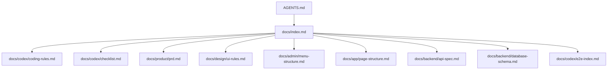
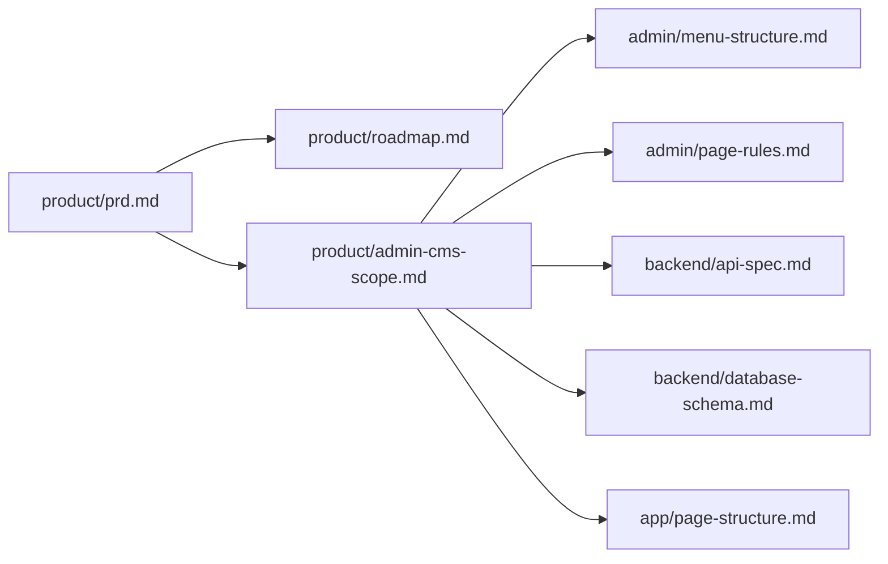
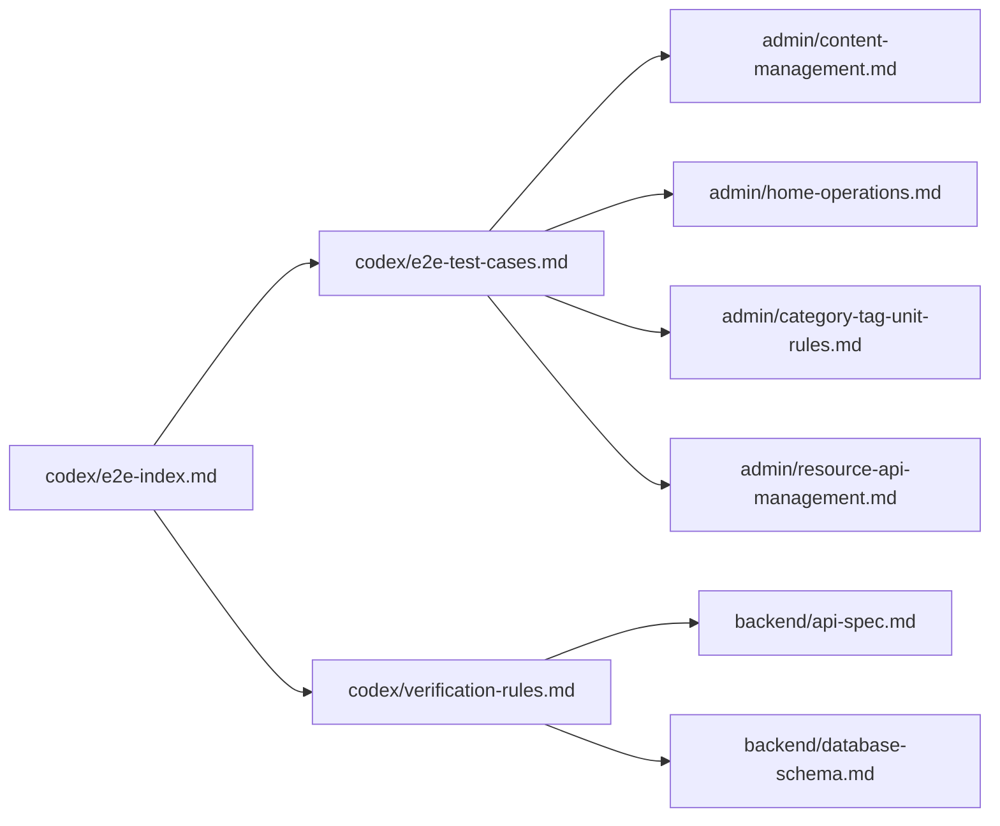

# 文档依赖图

## 总体依赖

```mermaid
flowchart TD
  AG["AGENTS.md"] --> IDX["docs/index.md"]
  IDX --> RULES["docs/codex/coding-rules.md"]
  IDX --> CHECK["docs/codex/checklist.md"]
  IDX --> PRODUCT["docs/product/prd.md"]
  IDX --> DESIGN["docs/design/ui-rules.md"]
  IDX --> ADMIN["docs/admin/menu-structure.md"]
  IDX --> APP["docs/app/page-structure.md"]
  IDX --> API["docs/backend/api-spec.md"]
  IDX --> DB["docs/backend/database-schema.md"]
  IDX --> E2E["docs/codex/e2e-index.md"]
```

## 产品到实现

```mermaid
flowchart LR
  PRD["product/prd.md"] --> ROAD["product/roadmap.md"]
  PRD --> ADMIN_SCOPE["product/admin-cms-scope.md"]
  ADMIN_SCOPE --> ADMIN_MENU["admin/menu-structure.md"]
  ADMIN_SCOPE --> ADMIN_RULES["admin/page-rules.md"]
  ADMIN_SCOPE --> API["backend/api-spec.md"]
  ADMIN_SCOPE --> DB["backend/database-schema.md"]
  ADMIN_SCOPE --> APP["app/page-structure.md"]
```

## E2E 验证

```mermaid
flowchart LR
  E2E["codex/e2e-index.md"] --> CASES["codex/e2e-test-cases.md"]
  E2E --> VERIFY["codex/verification-rules.md"]
  CASES --> ADMIN_CONTENT["admin/content-management.md"]
  CASES --> ADMIN_HOME["admin/home-operations.md"]
  CASES --> CATEGORY["admin/category-tag-unit-rules.md"]
  CASES --> RESOURCE["admin/resource-api-management.md"]
  VERIFY --> API["backend/api-spec.md"]
  VERIFY --> DB["backend/database-schema.md"]
```
