# 项目文档导航

本文档是 chufangapp 的文档入口。新任务优先从这里定位文档，不再默认读取旧长 PRD 或长任务书。

## 快速入口

| 类型 | 必读文档 | 说明 |
|---|---|---|
| 通用任务 | `AGENTS.md`、`docs/codex/coding-rules.md`、`docs/codex/checklist.md` | 修改范围、执行规则、输出要求 |
| 产品任务 | `docs/product/prd.md`、`docs/product/roadmap.md` | 产品目标、范围、阶段 |
| C 端 UI | `docs/design/ui-rules.md`、`docs/app/page-structure.md`、`docs/app/route-map.md` | 移动端页面、视觉、路由 |
| 后台页面 | `docs/admin/menu-structure.md`、`docs/admin/page-rules.md` | 菜单、列表、表单、弹窗、分页 |
| 后端接口 | `docs/backend/api-spec.md`、`docs/backend/auth.md` | API 规范、鉴权 |
| 数据库 | `docs/backend/database-schema.md`、`docs/backend/field-models.md` | Prisma 模型、字段 |
| 全链路测试 | `docs/codex/e2e-index.md`、`docs/codex/e2e-test-cases.md`、`docs/codex/verification-rules.md` | E2E 范围、测试、验收 |
| Codex 输出压缩 | `docs/codex/headroom.md` | Headroom 安装、命令前查看/压缩规则、MCP 接入说明 |

## 文档分层

```text
docs/
  product/   产品目标、路线图、后台 PRD 范围
  design/    UI、颜色、图标规范
  backend/   数据库、API、鉴权、字段模型
  admin/     后台菜单、页面规则、内容模块规则
  app/       C 端页面结构、路由
  codex/     Codex 执行规则、检查清单、E2E、进度、依赖图
```

## 旧长文档处理

以下旧长文档已改为短索引，详细内容拆到对应目录：

- `docs/admin-cms-prd-dev-spec.md`
- `docs/codex-full-e2e-prototype-execution-spec.md`
- `docs/codex-strict-e2e-execution-spec.md`
- `docs/codex-content-management-task.md`
- `docs/progress-report.md`

用户提到的 `docs/prod-full-e2e-prototype-execution-spec.md` 原仓库中不存在，已新增为兼容索引，指向 `docs/codex/e2e-index.md`。

## 依赖图

```mermaid
flowchart TD
  A["AGENTS.md"] --> I["docs/index.md"]
  I --> C["docs/codex/coding-rules.md"]
  I --> K["docs/codex/checklist.md"]
  I --> H["docs/codex/headroom.md"]
  I --> P["docs/product/prd.md"]
  I --> D["docs/design/ui-rules.md"]
  I --> B["docs/backend/api-spec.md"]
  I --> DB["docs/backend/database-schema.md"]
  I --> AD["docs/admin/menu-structure.md"]
  I --> AR["docs/admin/page-rules.md"]
  I --> APP["docs/app/page-structure.md"]
  I --> E2E["docs/codex/e2e-index.md"]

  P --> R["docs/product/roadmap.md"]
  P --> APS["docs/product/admin-cms-scope.md"]
  D --> CS["docs/design/color-system.md"]
  D --> IR["docs/design/icon-rules.md"]
  B --> AUTH["docs/backend/auth.md"]
  DB --> FM["docs/backend/field-models.md"]
  AD --> CM["docs/admin/content-management.md"]
  AD --> HO["docs/admin/home-operations.md"]
  AD --> UF["docs/admin/user-family-content.md"]
  AD --> RA["docs/admin/resource-api-management.md"]
  AR --> INT["docs/admin/interaction-rules.md"]
  APP --> RM["docs/app/route-map.md"]
  E2E --> TC["docs/codex/e2e-test-cases.md"]
  E2E --> VR["docs/codex/verification-rules.md"]
```



## 维护规则

- 新需求先判断归属目录，再更新对应短文档。
- 单个文档目标控制在 300-500 行以内。
- 不把接口、数据库、字段、页面规则重复写进多个文档。
- 旧长文档只保留索引和跳转，不再承载详细规则。
