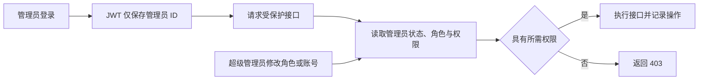

# 管理后台管理员与 RBAC 权限闭环设计

## 目标

把当前管理员管理、角色权限页面的前端固定数据替换为真实数据库和接口，并建立前后端双重权限控制。角色或账号状态修改后，下一个请求立即生效；绕过页面直接请求接口时也必须受到服务端权限校验。

本次只覆盖后台管理员账号、角色、权限目录、权限校验与相关操作日志，不扩展 C 端权限，也不建设报表、价格或 AI 模块。

## 已确认的产品规则

### 预置角色

- `SUPER_ADMIN`（超级管理员）：拥有全部权限，可管理管理员和角色。
- `CONTENT_OPERATOR`（内容运营）：管理首页、内容、用户与审核，不能管理后台账号或角色。
- `READ_ONLY`（只读人员）：可以查看已开放的真实数据页面，不能执行写操作。

预置角色属于系统角色：不可删除、不可修改编码。超级管理员权限固定为全部；内容运营与只读人员的权限由受控 seed 定义，后续可由超级管理员调整除系统账号管理之外的权限。

### 管理员角色归属

- 首期界面和接口均要求每个管理员恰好一个有效角色。
- 数据库继续使用现有 `AdminRole` 多对多表，不新增 `Admin.role` 重复字段。
- 保存角色时在事务中替换当前有效关联，保留未来扩展多角色的结构。

### 权限粒度

权限采用 `模块:资源:操作` 编码，例如：

- `content:recipe:view`
- `content:recipe:create`
- `content:recipe:update`
- `content:recipe:publish`
- `content:recipe:delete`
- `user:account:view`
- `user:account:create`
- `user:account:reset-password`
- `user:account:status`
- `system:admin:view`
- `system:admin:manage`
- `system:role:view`
- `system:role:manage`

报表和日志只授予 `view` 权限。前端用权限隐藏菜单、路由和按钮，服务端是最终安全边界。

## 方案选择

采用现有 RBAC 数据模型并补齐接口和双端校验：

`Admin → AdminRole → Role → RolePermission → Permission`

没有采用以下方案：

- 不在 `Admin` 表新增单一 `role` 字段，避免重复数据和后续迁移。
- 不把完整权限固化进 JWT，避免角色变更后旧 Token 在过期前仍保留权限。

JWT 只保存管理员身份。每个受保护请求查询当前管理员状态、有效角色和权限，因此停用管理员、停用角色或修改权限后立即生效。

## 数据模型调整

沿用现有五张表，并做最小增量字段补充：

### Admin

- 保留：`username`、`passwordHash`、`nickname`、`status`、软删除和审计字段。
- 新增 `lastLoginAt`，登录成功后更新，用于管理员列表真实展示。
- 密码只保存 bcrypt 哈希，任何序列化、日志和错误信息都不得包含哈希或明文。

### Role

- 新增唯一 `code`，用于稳定识别三个预置角色和自定义角色。
- 新增 `isSystem`，标识不可删除、不可修改编码的预置角色。
- 继续使用 `name`、`description`、`status` 和软删除。

### Permission

- 继续使用唯一 `key` 作为权限编码。
- 新增或明确维护 `module` 与 `action`，用于后台按模块分组和权限矩阵展示。
- 权限目录由受控 seed 维护，管理页面只读，不提供任意创建权限编码的入口。

### AdminRole / RolePermission

- 有效关联条件统一为 `deletedAt = null` 且 `status = ACTIVE`。
- 角色替换与权限替换使用事务，旧关联软删除或复用恢复，不能留下同一管理员多个有效角色。

迁移仅新增字段和索引，不删除历史记录、不清库。seed 需要幂等创建权限目录和三个预置角色，并把现有 seed 管理员绑定到超级管理员。

## 服务端鉴权设计

### 认证上下文

`requireAdminAuth` 除了验证 JWT，还必须查询管理员当前状态。管理员不存在、已删除或已停用时返回 401，不继续使用旧 Token。

新增统一权限中间件：

```ts
requireAdminPermission('content:recipe:update')
```

行为：

1. 从认证上下文取得管理员 ID。
2. 查询有效角色和有效权限。
3. `SUPER_ADMIN` 视为拥有 `*`。
4. 权限存在时继续处理。
5. 权限缺失时返回 HTTP 403，统一响应文案为“无权限执行此操作”。

认证和权限查询可以在同一次请求内缓存到 `req.adminAccess`，避免一个请求重复查询数据库；不做跨请求缓存，保证修改立即生效。

### 路由接入规则

- 所有后台路由继续要求 `requireAdminAuth`。
- 读取接口增加对应 `view` 权限。
- 新增、编辑、发布、启停、删除分别要求匹配的操作权限。
- 管理员和角色接口要求 `system:admin:*`、`system:role:*`。
- 首期对已经进入正式导航和真实数据链路的路由完成权限覆盖；仍是明确占位/只读演示的页面不新增假写接口。

## 接口设计

### 认证

- `POST /api/admin/auth/login`
  - 登录成功更新 `lastLoginAt`。
  - 响应返回 Token、管理员基本信息、单一角色和最终权限集合。
- `GET /api/admin/auth/profile`
  - 返回当前管理员、角色和最终权限集合。
  - 不返回 `passwordHash`。

### 管理员

- `GET /api/admin/admins`
  - 支持 `page`、`pageSize`、`q`、`roleId`、`status`。
- `GET /api/admin/admins/:id`
- `POST /api/admin/admins`
  - 账号、昵称、初始密码、一个角色必填。
- `PUT /api/admin/admins/:id`
  - 修改昵称和角色；账号默认不可修改，避免审计身份漂移。
- `PUT /api/admin/admins/:id/password`
  - 独立重置密码。
- `PATCH /api/admin/admins/:id/status`
- `DELETE /api/admin/admins/:id`
  - 软删除。

### 角色与权限目录

- `GET /api/admin/roles`
- `GET /api/admin/roles/:id`
- `POST /api/admin/roles`
- `PUT /api/admin/roles/:id`
- `PUT /api/admin/roles/:id/permissions`
  - 事务替换完整权限 ID 列表。
- `PATCH /api/admin/roles/:id/status`
- `DELETE /api/admin/roles/:id`
- `GET /api/admin/permissions`
  - 返回按 `module` 分组、按 `sort` 排序的只读权限目录。

分页响应继续使用项目统一 `PageResult`；参数错误为 400，未认证为 401，无权限为 403，业务冲突为 409，不存在为 404。

## 安全约束

- 当前管理员不能停用或删除自己。
- 系统必须至少保留一个有效的 `SUPER_ADMIN` 管理员。
- 最后一个有效超级管理员不能被停用、删除或改成其他角色。
- `SUPER_ADMIN` 角色不能停用、删除或移除权限。
- 被有效管理员使用的角色不能删除；停用角色前也必须确认没有有效管理员使用。
- 系统角色编码不可修改；自定义角色编码创建后也不可修改。
- 管理员账号重复、角色编码重复返回 409。
- 新密码最少 8 位，必须包含字母和数字；使用 bcrypt 成本参数 10。
- API、浏览器存储和操作日志不得出现密码哈希、明文密码或 Token。

所有保护检查和数据修改必须处于同一数据库事务，避免并发请求同时绕过“最后一个超级管理员”检查。

## 操作日志

管理员创建、编辑、重置密码、启停、删除，以及角色创建、编辑、权限替换、启停、删除，都写入 `OperationLog`。

日志记录：操作者管理员 ID、模块、动作、HTTP 方法、路径、响应结果和非敏感变更摘要。密码字段、Authorization Header、Token、哈希必须先移除；密码重置只记录“已重置密码”，不记录具体值。

## 后台交互设计

### 管理员管理页

- 真实分页列表，支持账号/昵称搜索、角色和状态筛选。
- 统计卡只显示真实管理员总数、启用账号数和角色数；没有真实统计来源的“今日操作”不展示。
- 新增抽屉：账号、昵称、初始密码、单一角色、启用状态。
- 编辑抽屉：昵称、单一角色、启用状态；账号只读。
- 密码通过独立“重置密码”操作处理。
- 当前账号和最后一个超级管理员的危险操作在前端禁用并说明原因，后端仍独立校验。

### 角色权限页

- 左侧为真实角色分页/筛选列表，显示管理员数、权限数、系统角色标识和状态。
- 右侧为真实权限目录，按模块分组，支持模块全选和单项勾选。
- 超级管理员权限树只读且全部选中。
- 系统角色不可删除、不可编辑编码；自定义角色可编辑名称、说明和权限。
- 被管理员使用的角色显示人数并禁用删除。

### 菜单、路由与按钮

- `loadAdminUser` 持久化 profile 返回的角色和权限，不再默认返回 `['*']`。
- 导航根据权限过滤；父菜单没有任何可访问子项时隐藏。
- `RequirePermission` 保护直接输入 URL 的场景，显示 403 页面。
- 写操作按钮根据对应操作权限隐藏或禁用。
- 前端收到 401 时清理会话并进入登录页；403 显示无权限提示，不伪装成网络错误。

## 数据流



## 测试与验收

### 服务端自动化

1. 登录和 profile 返回角色与权限，但不返回密码哈希。
2. 停用管理员持有的旧 Token 在下一个请求返回 401。
3. 内容运营可访问内容写接口，访问管理员管理接口返回 403。
4. 只读人员可读取内容，新增、编辑、发布和删除均返回 403。
5. 绕过前端直接请求无权限接口仍返回 403。
6. 管理员创建、编辑、单角色替换、密码重置、启停和软删除真实落库。
7. 当前管理员不能停用或删除自己。
8. 最后一个有效超级管理员保护在并发事务下仍成立。
9. 预置角色保护、使用中角色保护、权限完整替换正确。
10. 操作日志不包含密码、哈希或 Token。

### 后台自动化

1. 管理员与角色页面不再引用 `resolveMockList` 或固定数组。
2. profile 权限真实写入会话并驱动菜单、路由和按钮。
3. 401、403、409 分别显示正确体验。
4. 表单必填、密码规则、防重复提交和错误保留状态正确。

### 内置浏览器验收

1. 超级管理员创建内容运营和只读测试账号。
2. 内容运营登录后可编辑内容，看不到管理员与角色菜单；直调系统接口返回 403。
3. 只读人员登录后能查看内容，但没有新增、编辑、发布、删除按钮；直调写接口返回 403。
4. 超级管理员修改角色权限后，目标账号无需重新登录，下一个请求立即生效。
5. 验证不能停用、删除或降级最后一个超级管理员。
6. 验证角色使用中不能删除，操作日志可追踪且无敏感字段。

测试账号和角色使用可识别的 `E2E-RBAC-20260813-*` 前缀；验收结束只清理本轮创建且未被引用的数据，不删除既有管理员和角色。

## 影响范围与风险

- 数据库：为 Admin、Role、Permission 增加增量字段并补充幂等 seed；不清理历史数据。
- 后端：认证中间件、权限中间件、管理员/角色/权限接口、正式后台路由权限覆盖、操作日志。
- 后台：登录会话、导航/路由/按钮权限、管理员和角色页面。
- C 端：无影响。

主要风险是权限目录与现有导航编码不一致、历史管理员没有角色、以及一次性给所有后台路由加权限可能造成误拦截。实施时先建立权限常量和 seed 映射，再按模块分批接入并运行三角色权限矩阵；历史无角色管理员除 seed 管理员外默认拒绝访问，不自动授予超级权限。
